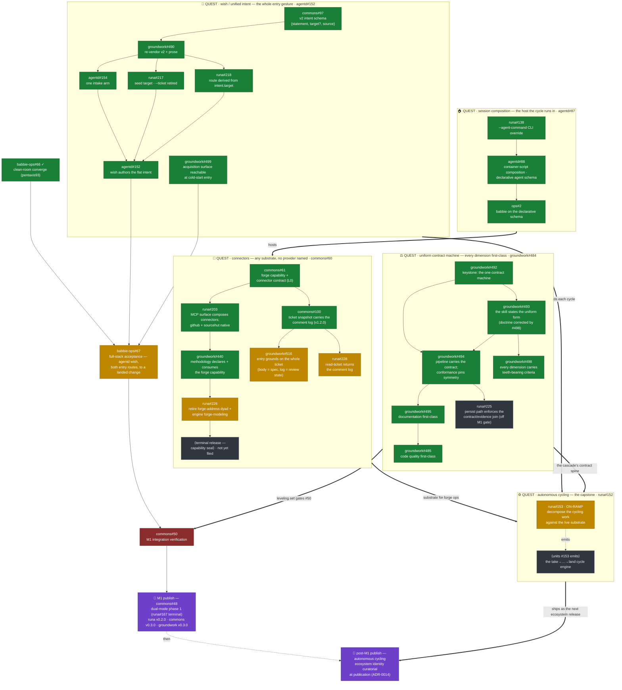

# Tesserine — Program-Line Map (the quest map)

*The navigable map of the feature lines that build the Tesserine **system**,
their work units, how they stack into one critical path, and how far each has
moved. This is the human's-eye view of the ecosystem's work graph — a single
legible document, rendered here by standard Mermaid, that you descend to reach
the live work.*

This map is the ecosystem's answer to **"where is the work going, and what's
next?"** — and the surface on which the feature lines are *reckoned*: what each
is made of, how they compose, what gates what, and in what order the releases
ship. It supersedes the nested-roadmap-in-issues realization (epic #85): the
graph does not hide inside issue bodies reachable only by descent — it lives
here, in one place, drawn.

## How to read it

A **quest** is a feature line — a coordinated, usually multi-repo architectural
theme that builds one capability of the system. A **work unit** is a single
tracked issue inside a quest. **Edges** are dependencies: what a quest (or
unit) needs before it can move. The five quests **stack into one critical
path** — four substrate quests feed the capstone, and the releases publish the
capabilities in sequence.

**Progress reads by color:**

| State | Meaning |
|---|---|
| 🟩 **landed** | the unit is merged/closed; the work is done |
| 🟨 **ready** | unblocked and craftable now — its predecessors have landed |
| ⬛ **open** | filed and live, but gated on something upstream — or named in its epic and not yet a discrete issue |
| 🟥 **blocked** | explicitly waiting on a named blocker |
| 🟪 **gate** | a convergence/release gate, not a work unit |

Every node that maps to a real issue names it (`repo#N`); descend to the tracker
for the unit's live body and comments. A node marked **⟨not yet filed⟩** is work
named in its quest's epic body but not yet a discrete issue — it points at the
epic, honestly, rather than a phantom number.

**Single Home.** This map holds the *lines, their stack, and their live
pointers* — not a copy of each issue's status text you could query. The trackers
are the live state; this is the stable graph over them. When a unit's *state*
changes, this map is refreshed against the tracker; when a quest's *shape*
changes (a line splits, a dependency reverses, a new line appears), that is an
architectural decision recorded here deliberately.

---

## The map

---

## The stack, in words

**What the lines are reaching for.** The five quests share one intention:
elegance — the cognition the ecosystem implements. Intent enters **once**, at
the seed. **State is the interface**: one idempotent operation infers its work
from assessed state (runa ADR-0001) and, cycled, drives it to done. Every seam
is a **declared contract with a single home** — capability over provider
(ADR-0016/0017), composition over configuration (ADR-0008), mode a property of
the session, never the operation (ADR-0015) — and **one contract machine** in
which every dimension of done is a first-class, evidenced citizen (groundwork
ADR-0007). Nothing is inferred twice; nothing is privileged; nothing ships
dead.

- **wish / unified intent** (agentd#152) is the **whole entry gesture**: the
  operator wishes; the system receives a flat, conforming `intent`
  (`{statement, target?, source}`) and derives everything else from state. The
  quest's unit set is **fully landed**: the upstream landing set (commons#97 →
  groundwork#490 → agentd#154 → runa#217/#218), the verb **agentd#152**
  (`agentd wish` authors the flat seed; PR #156 → `dd565a72`), and
  **groundwork#499** (the methodology's acquisition surface reachable at
  cold-start, so a *targeted* intent materializes its work-unit). Both
  terminal units feed the full-stack acceptance, now unblocked. The
  capability ships at M1; operator decision 2026-07-01 stands: every entry
  route the shipped surface exposes is exercised end-to-end before
  publication.
- **autonomous cycling** (runa#152) is the **capstone** — the runtime layer
  that consumes the seed and drives the take→…→land cascade to completion
  without an operator between intent and done. It runs its forge operations
  *through* connectors, executes *within* the composed host, and cycles the
  cascade whose spine is the uniform contract. Its on-ramp, **runa#153**, is
  ready: it decomposes the cycling work against the substrate as it now stands
  (dual-mode surface, seed-target routing, unified intent, one contract
  machine); the units it emits become this quest's body. Cycling **ships as
  the ecosystem release after M1**.
- **connectors** (commons#60) is the **substrate** each cycle's forge
  operations run through: a methodology declares a capability, a connector
  provides it over one provider, the agent receives it as native MCP tools.
  The L0 contract (#61), the runa surface with both provider connectors
  (runa#203), and the methodology's consumption (groundwork#440) have all
  **landed**. Next up: **runa#226** (retire the forge-address dyad and engine
  forge-modeling) is filed and ready; then the capability-seal release, still
  ⟨not yet filed⟩ and gated on #226.
- **session composition** (agentd#87) is the **host** the cycle runs in
  (ADR-0008: agentd composes the runtime; runa owns `.runa/`). Its engineering
  is **landed** across all three repos (runa#138, agentd#88, ops#2). The
  epic's remaining gate is operational: recorded evidence of the composed
  stack dispatching on babbie — which the full-stack acceptance
  (babbie-ops#67) supplies in passing.
- **uniform contract machine** (groundwork#484) is the **cascade's contract
  spine**: one contract surface, one evidence surface, one detectability
  mechanism — behavior, documentation, and code quality symmetric citizens,
  criteria typed executable-or-attested, teeth mandatory. The **contract-doctrine
  layer is complete**: the keystone (#492), the skill's uniform form (#493), and
  #498 (teeth on every dimension the change has — correcting #493's doctrine that
  structural symmetry alone had let license a silent/pointer-covered dimension,
  now removed from all four authoring surfaces) have **landed**. The leveling set
  lands as three sequenced landings — **#494 → #495 → #485** (pipeline +
  conformance, which also enforces #498's invariant; then documentation; then
  code quality) — edge rationale recorded on groundwork#484 (2026-07-02).
  **#494 has landed** (PR #508, squash `c21e0bf5`, 2026-07-02): the pipeline
  schemas key off contract criteria by `criterion_id`, the criterion-join
  detector serves every dimension, and the conformance tests pin symmetry.
  **#495 has landed** (PR #509, squash `98d1f158`, 2026-07-02): the canonical
  exemplar's documentation criterion is a user-pillar audience outcome, the
  three recipient pillars are machine-touched exemplar criteria, and a hollow
  documentation criterion fails the shared warranted check — all pinned by
  focused conformance. **#485 has landed** (PR #510, squash `4218d03d`,
  2026-07-02): the reference import-direction fitness function gives structural
  projections a real executable check (seeded violation red; groundwork's own
  `tooling → tests` edge enforced), the projection exemplar pair inhabits both
  check kinds with attested universals resolved verbatim in the embedded corpus,
  and a hollow code-quality criterion fails the shared warranted check — all
  pinned by focused conformance. **The leveling set is complete.** The runtime persist half split out of #494 to
  **runa#225**, off the M1 gate. **The
  leveling set gates M1 integration verification (commons#50)** by operator
  decision (2026-07-01); the enrichments (#486/#487/#488) are deliberately
  deferred off the M1 path.

## Release sequencing

Two publications, in order, both through the ecosystem-release ceremony
(`ECOSYSTEM-RELEASE.md`, ADR-0011/0012/0014):

1. **M1 — dual-mode phase 1** (`commons#48`, the terminal child of runa#167).
   Binds the component tags **runa v0.2.0 · commons v0.3.0 · groundwork
   v0.3.0**. Gated on integration verification (`commons#50`), which is gated
   on the contract-machine leveling set **and** the full-stack acceptance
   chain: `agentd#152` + `groundwork#499` → `babbie-ops#67` (entry via
   `agentd wish`, **both** entry routes exercised to a landed change) →
   `commons#50` → publish. *runa v0.2.0 is M1's component tag — it is not the
   cycling release's name.*
2. **Post-M1 — autonomous cycling** (runa#152's capability). Ships as the
   following ecosystem release; its ecosystem identity is **curatorial,
   chosen at publication** (ADR-0014). runa#167's phase 2 (the autonomous
   orchestrator as a thin client of the dual-mode surface) is decomposed in
   concert with this quest once M1 lands.

## What's ready right now

Five units are unblocked and craftable this moment:

- **babbie-ops#67** — the full-stack acceptance (`agentd wish`, both entry
  routes, to a landed change); every drawn predecessor is landed. The
  recorded consideration (operator decision B, 2026-07-01, on the issue) is
  satisfied: the leveling set landed 2026-07-02, so the cascade exercises the
  corrected symmetric contract. #67 is the M1 critical-path front.
- **runa#153** — decompose the cycling capstone against the live substrate.
- **runa#226** — retire the forge-address dyad + engine forge-modeling (connectors line; **off the M1 path** — advances the post-M1 cycling runway at no critical-path cost).
- **groundwork#516** — entry grounds on the whole ticket: `acquire` reads the snapshot whole, `take`'s Frame gains the review-state discipline (body = spec, log = record). Consumes forge-capability v1.2.0 (commons#100, landed 2026-07-02); connectors line, **off the M1 path**.
- **runa#228** — the forge connector's `read-ticket` returns the comment log per forge-capability v1.2.0 (commons#100, landed 2026-07-02). Parallel to groundwork#516 — independent consumers of the same contract; connectors line, **off the M1 path**.

Everything else is either landed, gated on an upstream quest, or work named in
an epic body that has not yet been filed as a discrete unit.

---

## Keeping this current

This map is refreshed against the trackers, not transcribed from them. Two kinds
of change:

- **State refresh (routine).** A unit lands, a gate clears — the node's color
  and the "ready" list are updated to match the tracker. This happens whenever
  the map is picked up and a line is known to have moved. It is a mechanical
  re-grounding: query the named issues, correct any drift, the tracker wins.
- **Shape change (deliberate).** A quest splits or merges, a dependency
  reverses, a new quest appears, a quest completes and its capability ships, or
  a quest is promoted into the release sequence. These are architectural
  decisions — recorded here consciously, and (for release promotion) reflected
  in the release-sequence roadmap, a coarser artifact than this one.

**Altitude.** This is the *program-line* map — finer-grained and more mutable
than the ecosystem **release-sequence** roadmap (which states only what ships
next: NEXT / THEN / LATER). A quest lands units continuously here; only when a
quest is promoted to a shipping release does the release sequence change. Do not
confuse the two: this map tracks the *lines and their progress*; the release
roadmap tracks the *order releases ship*.
