# Tesserine — Program-Line Map (the quest map)

*The navigable map of the feature lines that build the Tesserine **system**,
their work units, how they stack into one critical path, and how far each has
moved. This is the human's-eye view of the ecosystem's work graph — a single
legible document, rendered here by standard Mermaid, that you descend to reach
the live work.*

This map is the ecosystem's answer to **"where is the work going, and what's
next?"** — and the surface on which the feature lines are *reckoned*: what each
is made of, how they compose, what gates what, and in what order the releases
ship. It supersedes the nested-roadmap-in-issues realization (epic #85): the
graph does not hide inside issue bodies reachable only by descent — it lives
here, in one place, drawn.

## How to read it

A **quest** is a feature line — a coordinated, usually multi-repo architectural
theme that builds one capability of the system. A **work unit** is a single
tracked issue inside a quest. **Edges** are dependencies: what a quest (or
unit) needs before it can move. The five quests **stack into one critical
path** — four substrate quests feed the capstone, and the releases publish the
capabilities in sequence.

**Progress reads by color:**

| State | Meaning |
|---|---|
| 🟩 **landed** | the unit is merged/closed; the work is done |
| 🟨 **ready** | unblocked and craftable now — its predecessors have landed |
| ⬛ **open** | filed and live, but gated on something upstream — or named in its epic and not yet a discrete issue |
| 🟥 **blocked** | explicitly waiting on a named blocker |
| 🟪 **gate** | a convergence/release gate, not a work unit |

Every node that maps to a real issue names it (`repo#N`); descend to the tracker
for the unit's live body and comments. A node marked **⟨not yet filed⟩** is work
named in its quest's epic body but not yet a discrete issue — it points at the
epic, honestly, rather than a phantom number.

**Single Home.** This map holds the *lines, their stack, and their live
pointers* — not a copy of each issue's status text you could query. The trackers
are the live state; this is the stable graph over them. When a unit's *state*
changes, this map is refreshed against the tracker; when a quest's *shape*
changes (a line splits, a dependency reverses, a new line appears), that is an
architectural decision recorded here deliberately.

---

## The map

```mermaid
flowchart TB
    classDef landed  fill:#1a7f37,stroke:#0a4a1f,color:#ffffff;
    classDef ready   fill:#bf8700,stroke:#7a5600,color:#ffffff;
    classDef open    fill:#30363d,stroke:#8b949e,color:#e6edf3;
    classDef blocked fill:#8b2c2c,stroke:#5a1010,color:#ffffff;
    classDef gate    fill:#6e40c9,stroke:#3d2277,color:#ffffff;

    %% ================= QUEST 1: wish / unified intent — the whole entry gesture =================
    subgraph Q1["🌱 QUEST · wish / unified intent — the whole entry gesture · agentd#152"]
        direction TB
        q1_97["commons#97<br/>v2 intent schema<br/>{statement, target?, source}"]:::landed
        q1_490["groundwork#490<br/>re-vendor v2 + prose"]:::landed
        q1_154["agentd#154<br/>one intake arm"]:::landed
        q1_217["runa#217<br/>seed target · --ticket retired"]:::landed
        q1_218["runa#218<br/>route derived from intent.target"]:::landed
        q1_152["agentd#152<br/>wish authors the flat intent"]:::landed
        q1_499["groundwork#499<br/>acquisition surface reachable<br/>at cold-start entry"]:::landed
        q1_97 --> q1_490
        q1_490 --> q1_154 --> q1_152
        q1_490 --> q1_217 --> q1_152
        q1_490 --> q1_218 --> q1_152
    end

    %% ================= QUEST 2: autonomous cycling (CAPSTONE) =================
    subgraph Q2["⚙️ QUEST · autonomous cycling — the capstone · runa#152"]
        direction TB
        q2_153["runa#153 · ON-RAMP<br/>decompose the cycling work<br/>against the live substrate"]:::ready
        q2_more["⟨units #153 emits⟩<br/>the take→…→land cycle engine"]:::open
        q2_153 -. "emits" .-> q2_more
    end

    %% ================= QUEST 3: connectors (substrate) =================
    subgraph Q3["🔌 QUEST · connectors — any substrate, no provider named · commons#60"]
        direction TB
        q3_61["commons#61<br/>forge capability +<br/>connector contract (L0)"]:::landed
        q3_203["runa#203<br/>MCP surface composes connectors;<br/>github + sourcehut native"]:::landed
        q3_440["groundwork#440<br/>methodology declares + consumes<br/>the forge capability"]:::landed
        q3_226["runa#226<br/>retire forge-address dyad +<br/>engine forge-modeling"]:::ready
        q3_rel["⟨terminal release —<br/>capability seal⟩ · not yet filed"]:::open
        q3_61 --> q3_203 --> q3_440 --> q3_226 --> q3_rel
        q3_100["commons#100<br/>ticket snapshot carries the<br/>comment log (v1.2.0)"]:::landed
        q3_516["groundwork#516<br/>entry grounds on the whole ticket<br/>(body = spec, log = review state)"]:::landed
        q3_228["runa#228<br/>read-ticket returns<br/>the comment log"]:::landed
        q3_61 --> q3_100
        q3_100 --> q3_516
        q3_100 --> q3_228
        q3_106["commons#106<br/>neutral op names —<br/>read/create-work-unit (v2.0.0)"]:::landed
        q3_440 --> q3_106
    end

    %% ================= QUEST 4: session composition (host) =================
    subgraph Q4["🏠 QUEST · session composition — the host the cycle runs in · agentd#87"]
        direction TB
        q4_138["runa#138<br/>--agent-command CLI override"]:::landed
        q4_88["agentd#88<br/>container-script composition ·<br/>declarative agent schema"]:::landed
        q4_ops["ops#2<br/>babbie on the declarative schema"]:::landed
        q4_138 --> q4_88 --> q4_ops
    end

    %% ================= QUEST 5: the uniform contract machine =================
    subgraph Q5["⚖️ QUEST · uniform contract machine — every dimension first-class · groundwork#484"]
        direction TB
        q5_492["groundwork#492<br/>keystone: the one contract machine"]:::landed
        q5_493["groundwork#493<br/>the skill states the uniform form<br/>(doctrine corrected by #498)"]:::landed
        q5_494["groundwork#494<br/>pipeline carries the contract;<br/>conformance pins symmetry"]:::landed
        q5_495["groundwork#495<br/>documentation first-class"]:::landed
        q5_485["groundwork#485<br/>code quality first-class"]:::landed
        q5_498["groundwork#498<br/>every dimension carries<br/>teeth-bearing criteria"]:::landed
        q5_225["runa#225<br/>persist path enforces the<br/>contract/evidence join (off M1 gate)"]:::open
        q5_539["groundwork#539<br/>re-reckon of the whole contract machine — DONE<br/>direction: complete + meeting-surface axis;<br/>graded relay, gated + landed"]:::landed
        q5_582["groundwork#582<br/>ADR-0010: content kinds — behavior + meaning<br/>— LANDED (PR #588); Accepted 2026-07-10"]:::landed
        q5_573["groundwork#573<br/>meeting-surface axis: invocation-surface<br/>outcome with teeth; retrofit trigger rule —<br/>LANDED (PR #592); first client of ADR-0010<br/>on the live v-next schema"]:::landed
        q5_573ad["agentd#172<br/>retrofit operator-met help surfaces —<br/>LANDED (PR #182)"]:::landed
        q5_573ru["runa#237<br/>audit first-contact surfaces incl.<br/>runa-mcp self-descriptions"]:::ready
        q5_531["groundwork#531<br/>principle-derived contracts for open-ended units —<br/>landed (PR #579)"]:::landed
        q5_580["groundwork#580<br/>reconcile acceptance_criterion field authority<br/>(schema+protocol) with body-ground dual use<br/>— landed (PR #581)"]:::landed
        q5_cpend["groundwork#488 #486 #487<br/>contract-machine enrichments —<br/>re-grounded to ADR-0010 via #587 ✓ ·<br/>blocked by #583"]:::blocked
        q5_583["groundwork#583<br/>contract schema v-next: kind +<br/>operational check; check_kind retired —<br/>LANDED (PR #591); consumer weforge-ops#5"]:::landed
        q5_584["groundwork#584<br/>binding-policy home: policy.toml —<br/>LANDED (PR #589)"]:::landed
        q5_585["groundwork#585<br/>completion-evidence v-next:<br/>binding-stamped results —<br/>LANDED (PR #590)"]:::landed
        q5_586["groundwork#586<br/>epic: transmission harness —<br/>cold-recipient checks (post-M1)"]:::blocked
        q5_587["groundwork#587<br/>re-ground #484 frame +<br/>#486/#487/#488 to content kinds<br/>— LANDED 2026-07-10 (station-direct)"]:::landed
        q5_492 --> q5_493
        q5_492 --> q5_494
        q5_493 --> q5_494
        q5_493 --> q5_498
        q5_494 --> q5_495
        q5_495 --> q5_485
        q5_494 --> q5_225
        q5_498 --> q5_539
        q5_539 --> q5_582
        q5_582 --> q5_573
        q5_539 --> q5_531
        q5_531 --> q5_580
        q5_539 --> q5_cpend
        q5_573 --> q5_573ad
        q5_573 --> q5_573ru
        q5_582 --> q5_583
        q5_582 --> q5_584
        q5_582 --> q5_585
        q5_582 --> q5_586
        q5_582 --> q5_587
        q5_587 --> q5_cpend
        q5_583 --> q5_cpend
    end

    %% ================= QUEST 6: Radicle-native substrate =================
    subgraph Q6["🕸️ QUEST · Radicle-native substrate — the forge is the network · commons#108"]
        direction TB
        q6_mig["commons#109<br/>Tesserine repo homes migrate to Radicle<br/>(commons ✓ live · runa / groundwork / agentd)"]:::ready
        q6_adr["commons#108<br/>ADR: Radicle as native collaboration substrate<br/>(forge neutrality retired · gated on #50)"]:::blocked
        q6_gw["groundwork#538<br/>Radicle-native layer supersedes<br/>the connector system (stub)"]:::blocked
        q6_adr --> q6_gw
    end
    M1INT --> q6_adr
    q6_adr -. "supersedes on landing" .-> Q3

    %% ================= QUEST 7: intent-entry surface =================
    subgraph Q7["🪄 QUEST · intent-entry surface — wish declares, run dispatches · agentd#160 ✓ (#166 ✓ · #165 before M1 · #167–#168 after M1 + Radicle)"]
        direction TB
        q7_160["agentd#160 ✓<br/>spike: reckon the surface from the need —<br/>two acts (declare / dispatch), wish is the declarative home"]:::landed
        q7_165["agentd#165<br/>wish gains a supplied projection<br/>(noninteractive statement + target)<br/>→ before M1 release (parallel, not gating)"]:::ready
        q7_166["agentd#166 ✓<br/>desired-state wish copy<br/>→ landed before M1 (#67 DX-sufficiency)"]:::landed
        q7_167["agentd#167<br/>retire run --intent ⏸<br/>after M1 + Radicle (dep #165)"]:::blocked
        q7_168["agentd#168<br/>document consolidated surface ⏸<br/>after M1 + Radicle"]:::blocked
        q7_160 --> q7_165
        q7_160 --> q7_166
        q7_165 -->|"Sequence: projection<br/>before retirement"| q7_167
        q7_165 --> q7_168
        q7_167 --> q7_168
        q7_166 --> q7_168
    end

    %% ================= QUEST 8: Gazette — the production proof =================
    subgraph Q8["📰 QUEST · Gazette — substrate-primary agent newspaper · gazette#10"]
        direction TB
        q8_disc["commons#111<br/>design-as-substrate discipline<br/>(concepts/ — public home)"]:::landed
        q8_ds["commons#110<br/>Tesserine design system —<br/>tokens · type scale · section grammar"]:::landed
        q8_sub["gazette#11<br/>News Substrate contract<br/>(backbone — the paper as product)"]:::landed
        q8_tel["gazette#12 ✓<br/>Telemetry contract —<br/>stats co-equal + story-source"]:::landed
        q8_proj["gazette#13 ✓<br/>Projection contract —<br/>corpus → byte-identical site"]:::landed
        q8_des["gazette#14 ✓<br/>Design contract — declared substrate<br/>+ floor + mandated reckon-gate"]:::landed
        q8_prod["gazette#15 · PRODUCTION<br/>live 24/7 publishing to Radicle —<br/>the advanced integration test ⏸ post-M1"]:::blocked
        q8_disc --> q8_ds
        q8_sub --> q8_tel
        q8_sub --> q8_proj
        q8_sub --> q8_des
        q8_ds --> q8_proj
        q8_ds --> q8_des
        q8_tel --> q8_prod
        q8_proj --> q8_prod
        q8_des --> q8_prod
    end

    %% ================= QUEST 9: derived methodology — the basis generates =================
    subgraph Q9["📐 QUEST · derived methodology — the protocol layer derives from the typed basis · groundwork#541 (off M1 path)"]
        direction TB
        q9_540["groundwork#540 ✓<br/>spike: reckon verify — PASS (surplus proved generativity)"]:::landed
        q9_557["groundwork#557 ✓<br/>review pass — PASS; #548 routing CONFIRMED typed"]:::landed
        q9_556["groundwork#556 ✓<br/>submit pass — PASS; submit default fails-unsafe (→#551)"]:::landed
        q9_558["groundwork#558 ✓<br/>land pass — PASS; identity law un-homeable, #547-class (C-2 grammar proven)"]:::landed
        q9_vfix["groundwork#542 #543 #544 #545 #546<br/>verify: migrations + deltas"]:::ready
        q9_rev["groundwork#564 #565 #566 #567 #568<br/>review: migration + deltas"]:::ready
        q9_sub["groundwork#570 #571 #572<br/>submit: migration + deltas"]:::ready
        q9_land["groundwork#574 #575 #576 #577<br/>land: migration + deltas"]:::ready
        q9_555["groundwork#555<br/>stage-order gate (AC2)"]:::ready
        q9_319["groundwork#319<br/>C-2 coverage — authors the 5 missing contracts"]:::blocked
        q9_gated["groundwork#559 #560 #561 #562 #563<br/>passes: survey · decompose · define · plan · implement<br/>(gated on their contracts)"]:::blocked
        q9_find["groundwork#547 #548 #549 #551 #569 · #550 · #552 #553 #554<br/>basis-growth findings — the end-state homes<br/>(cross-artifact/lifecycle law · identity/substrate binding)<br/>frontier now definitively mapped; close the epic last"]:::open
        q9_540 --> q9_vfix
        q9_540 --> q9_555
        q9_540 --> q9_557
        q9_540 --> q9_556
        q9_540 --> q9_558
        q9_540 --> q9_gated
        q9_557 --> q9_rev
        q9_556 --> q9_sub
        q9_558 --> q9_land
        q9_319 --> q9_gated
        q9_vfix --> q9_find
        q9_rev --> q9_find
        q9_sub --> q9_find
        q9_land --> q9_find
        q9_gated --> q9_find
    end
    Q2 == "capstone proves on" ==> q8_prod
    Q6 == "publication substrate" ==> q8_prod

    %% ================= THE STACK =================
    Q4 == "hosts" ==> Q3
    Q3 == "substrate for forge ops" ==> Q2
    Q1 == "seeds each cycle" ==> Q2
    Q5 == "the cascade's contract spine" ==> Q2

    %% ================= CONVERGENCE / RELEASE SEQUENCE =================
    BO66["babbie-ops#66 ✓<br/>clean-room converge (pentaxis93)"]:::landed --> BO67
    q1_152 --> BO67
    q1_499 --> BO67
    BO81["babbie-ops#81 ✓<br/>installer passes through agentd<br/>generic bind mounts (~/.claude rw)"]:::landed --> BO67
    AGENTD158["agentd#158 ✓<br/>runner accepts host-only additional-mount<br/>source (containerized daemon → host Podman)"]:::landed --> BO67
    BO81 -. "host-side resolve via" .-> AGENTD158
    BO81 -. "reference for" .-> BO82
    BO82["babbie-ops#82<br/>codex runtime — both credential<br/>options (next release, off M1)"]:::ready
    COMMONS102["commons#102 ✓<br/>ADR-0020: run-record storage locus + ownership<br/>(sovereignty — project owns, executor projects)"]:::landed -- "decision authorizes →" --> AGENTD162
    AGENTD162["agentd#162 ✓<br/>nested runa transcript events read at the exact supplied run-id<br/>landed @ 01115fe8 (PR #163)"]:::landed --> AGENTD122
    AGENTD122["agentd#122 · code landed in PR #163<br/>live tailer reads the shared exact-run-id resolver<br/>closes on #67 operator evidence (suite-green gate ✓ via AGENTD180)"]:::ready --> BO67
    RUNBOOK96["babbie-ops#96 ✓<br/>runbook: consolidated operator-eyes<br/>evidence lifecycle (single home; #67 proves)"]:::landed --> BO67
    BO102["babbie-ops#102<br/>runbook: Drive the fixture states the live-observation<br/>and seed surfaces as present fact (off M1 path)"]:::ready
    RUNBOOK96 -. "revised by" .-> BO102
    BO100["babbie-ops#100 ✓<br/>converge wires the operator adapter into the session<br/>agent command (was runa go → no agent command)<br/>installer repair landed @ 094e10a8 (PR #101)"]:::landed --> BO67
    RUNA238["runa#238 ✓<br/>honors supplied RUNA_TRANSCRIPT_RUN_ID on per-stage write path<br/>single effective-settings home → writer + agent env + MCP env<br/>THE M1 observability fix · landed @ 53b064ba (PR #239)"]:::landed --> BO67
    BO67["babbie-ops#67 · CONSOLIDATED operator-eyes gate<br/>run 2026-07-09: live progress WORKS (one run_id, execution phase streams)<br/>HALTED: create-work-unit 403 → silent fallback → false session success<br/>BLOCKED on runa#244 + babbie-ops#103 · then re-run both routes"]:::blocked --> M1INT
    AGENTD174["agentd#174<br/>wish takes prose intent XOR work-unit ref, not both<br/>(targeted-route entry surface)"]:::landed --> BO67
    AGENTD175["agentd#175 ✓<br/>work-unit seed routed through runa's resolving entry (fail-closed)<br/>landed @ 662b6d32 (PR #179) · freshen half split to runa#243"]:::landed --> BO67
    RUNA244["runa#244<br/>work-unit delivery refuses an artifact whose tracker write failed<br/>(silent 403 → local artifact → session success) · M1 BLOCKER"]:::ready --> BO67
    BO103["babbie-ops#103<br/>converge credential's resource owner matches --forge-owner<br/>(pentaxis93 PAT paired with tesserine fixture → 403) · M1 BLOCKER"]:::ready --> BO67
    RUNA243["runa#243 · IN FLIGHT (station-direct)<br/>re-entry to a recorded work-unit freshens vs current substrate before define<br/>(freshen half of #175 · run_bound skips the acquire surface)<br/>contract posted 2026-07-10 · targeted-route hygiene"]:::ready -. "hygiene for" .-> BO67
    GW595["groundwork#595<br/>acquire delivery states re-entry semantics<br/>(already-recorded work-unit · seam runa#243 exercises)<br/>off M1 path"]:::ready -. "consulted by" .-> RUNA243
    AGENTD176["agentd#176 · code landed in PR #177<br/>live observation renders the transcript usefully to the terminal<br/>closes on #67 operator evidence (suite-green gate ✓ via AGENTD180)"]:::ready --> BO67
    AGENTD180["agentd#180 ✓<br/>daemon shutdown-ordering tests assert ordering, not wall-clock<br/>landed @ 53be589b (PR #185) · main CI green · suite-green gate discharged"]:::landed --> AGENTD122
    AGENTD180 --> AGENTD176
    Q5 == "leveling set gates #50" ==> M1INT
    M1INT["commons#50<br/>M1 integration verification"]:::blocked --> M1REL
    M1REL["🏁 M1 publish — commons#48<br/>dual-mode phase 1 (runa#167 terminal)<br/>runa v0.2.0 · commons v0.3.0 · groundwork v0.3.0"]:::gate
    Q2 == "ships as the next ecosystem release" ==> VNEXT
    M1REL -. "then" .-> VNEXT
    VNEXT["🏁 post-M1 publish — autonomous cycling<br/>ecosystem identity curatorial<br/>at publication (ADR-0014)"]:::gate
```

---

## The stack, in words

**What the lines are reaching for.** The five quests share one intention:
elegance — the cognition the ecosystem implements. Intent enters **once**, at
the seed. **State is the interface**: one idempotent operation infers its work
from assessed state (runa ADR-0001) and, cycled, drives it to done. Every seam
is a **declared contract with a single home** — capability over provider
(ADR-0016/0017), composition over configuration (ADR-0008), mode a property of
the session, never the operation (ADR-0015) — and **one contract machine** in
which every dimension of done is a first-class, evidenced citizen (groundwork
ADR-0007). Nothing is inferred twice; nothing is privileged; nothing ships
dead.

- **wish / unified intent** (agentd#152) is the **whole entry gesture**: the
  operator wishes; the system receives a flat, conforming `intent`
  (`{statement, target?, source}`) and derives everything else from state. The
  quest's unit set is **fully landed**: the upstream landing set (commons#97 →
  groundwork#490 → agentd#154 → runa#217/#218), the verb **agentd#152**
  (`agentd wish` authors the flat seed; PR #156 → `dd565a72`), and
  **groundwork#499** (the methodology's acquisition surface reachable at
  cold-start, so a *targeted* intent materializes its work-unit). Both
  terminal units feed the full-stack acceptance, now unblocked. The
  capability ships at M1; operator decision 2026-07-01 stands: every entry
  route the shipped surface exposes is exercised end-to-end before
  publication.
- **autonomous cycling** (runa#152) is the **capstone** — the runtime layer
  that consumes the seed and drives the take→…→land cascade to completion
  without an operator between intent and done. It runs its forge operations
  *through* connectors, executes *within* the composed host, and cycles the
  cascade whose spine is the uniform contract. Its on-ramp, **runa#153**, is
  ready: it decomposes the cycling work against the substrate as it now stands
  (dual-mode surface, seed-target routing, unified intent, one contract
  machine); the units it emits become this quest's body. Cycling **ships as
  the ecosystem release after M1**.
- **connectors** (commons#60) is the **substrate** each cycle's forge
  operations run through: a methodology declares a capability, a connector
  provides it over one provider, the agent receives it as native MCP tools.
  The L0 contract (#61), the runa surface with both provider connectors
  (runa#203), and the methodology's consumption (groundwork#440) have all
  **landed**. Next up: **runa#226** (retire the forge-address dyad and engine
  forge-modeling) is filed and ready; then the capability-seal release, still
  ⟨not yet filed⟩ and gated on #226.
- **session composition** (agentd#87) is the **host** the cycle runs in
  (ADR-0008: agentd composes the runtime; runa owns `.runa/`). Its engineering
  is **landed** across all three repos (runa#138, agentd#88, ops#2). The
  epic's remaining gate is operational: recorded evidence of the composed
  stack dispatching on babbie — which the full-stack acceptance
  (babbie-ops#67) supplies in passing.
- **uniform contract machine** (groundwork#484) is the **cascade's contract
  spine**: one contract surface, one evidence surface, one detectability
  mechanism — behavior, documentation, and code quality symmetric citizens as
  source/coverage lenses; criteria carry a content kind — behavior or meaning —
  with operational checks, execution binding as policy (ADR-0010), teeth
  mandatory. The **contract-doctrine
  layer is complete**: the keystone (#492), the skill's uniform form (#493), and
  #498 (teeth on every dimension the change has — correcting #493's doctrine that
  structural symmetry alone had let license a silent/pointer-covered dimension,
  now removed from all four authoring surfaces) have **landed**. The leveling set
  lands as three sequenced landings — **#494 → #495 → #485** (pipeline +
  conformance, which also enforces #498's invariant; then documentation; then
  code quality) — edge rationale recorded on groundwork#484 (2026-07-02).
  **#494 has landed** (PR #508, squash `c21e0bf5`, 2026-07-02): the pipeline
  schemas key off contract criteria by `criterion_id`, the criterion-join
  detector serves every dimension, and the conformance tests pin symmetry.
  **#495 has landed** (PR #509, squash `98d1f158`, 2026-07-02): the canonical
  exemplar's documentation criterion is a user-pillar audience outcome, the
  three recipient pillars are machine-touched exemplar criteria, and a hollow
  documentation criterion fails the shared warranted check — all pinned by
  focused conformance. **#485 has landed** (PR #510, squash `4218d03d`,
  2026-07-02): the reference import-direction fitness function gives structural
  projections a real executable check (seeded violation red; groundwork's own
  `tooling → tests` edge enforced), the projection exemplar pair inhabits both
  check kinds with attested universals resolved verbatim in the embedded corpus,
  and a hollow code-quality criterion fails the shared warranted check — all
  pinned by focused conformance. **The leveling set is complete.** The runtime persist half split out of #494 to
  **runa#225**, off the M1 gate. **The
  leveling set gates M1 integration verification (commons#50)** by operator
  decision (2026-07-01); the enrichments (#486/#487/#488) are deliberately
  deferred off the M1 path. **#587 has landed** (2026-07-10, station-direct):
  #484's frame and the three enrichment children re-grounded to ADR-0010's
  content-kind ontology; the enrichments now gate on #583 (schema v-next;
  #486 also on #584), evidence on groundwork#587.

## The Gazette quest — the production proof (Q8)

**Gazette** (gazette#10) is the ecosystem's first production agent and its
advanced integration test: a **substrate-primary newspaper** — the
machine-readable corpus is the product, the website one projection of it, the
agent reading path canonical. Its **spec arc** — News Substrate (gazette#11)
→ Telemetry (#12) → Projection (#13) → Design (#14) contracts, with the
design system (commons#111 discipline → commons#110 system) authored
first, top-down, as the rendering half's prerequisite — runs **now, off the
M1 path**, graded-relay-friendly. Its **production arc** (gazette#15) —
live 24/7, publishing to Radicle — is the downstream acceptance of autonomous
cycling (Q2) on the Radicle substrate (Q6): the true pass is the running
system. Gazette forces substrate by being a production agent; blockers its
publish path surfaces are deliverables. Placed by operator decision
2026-07-06; the SourceHut chronicler line (gazette#1–#3) is retired into the
program.

## Release sequencing

Two publications, in order, both through the ecosystem-release ceremony
(`ECOSYSTEM-RELEASE.md`, ADR-0011/0012/0014):

1. **M1 — dual-mode phase 1** (`commons#48`, the terminal child of runa#167).
   Binds the component tags **runa v0.2.0 · commons v0.3.0 · groundwork
   v0.3.0**. Gated on integration verification (`commons#50`), which is gated
   on the contract-machine leveling set **and** the full-stack acceptance
   chain: `agentd#152` + `groundwork#499` → **`babbie-ops#81`** (generic bind-mount
   pass-through — carries the acceptance run's read-only `~/.claude`
   subscriber-OAuth credential mount, resolved host-side by **`agentd#158`** so
   the containerized daemon accepts the host-only source) → `babbie-ops#67` (entry via
   `agentd wish`, **both** entry routes exercised to a landed change, with
   **live progress observed** — gated on `agentd#122`, itself now gated on
  the transcript-path-contract impl (locus decided in ADR-0020, `commons#102`)) →
   `commons#50` → publish. *runa v0.2.0 is M1's component tag — it is not the
   cycling release's name.*
2. **Post-M1 — autonomous cycling** (runa#152's capability). Ships as the
   following ecosystem release; its ecosystem identity is **curatorial,
   chosen at publication** (ADR-0014). runa#167's phase 2 (the autonomous
   orchestrator as a thin client of the dual-mode surface) is decomposed in
   concert with this quest once M1 lands.

## What's ready right now

**Refreshed 2026-07-06 (PR #169 review-passed).** The **#122-on-#162 verification build is built and review-passed** — PR #169 @ `08c9199`, stacked on #162's `ba5fcbd`, draft/not-merge. babbie-ops#67 is now **operator-runnable**: the operator checks out `issue-122-live-progress-on-162` on babbie-dev, converges, and drives the one consolidated `agentd wish` session collecting all three evidence sets. On acceptance, #162 (PR #163) and #122 (PR #169) merge and epic #58 closes. Nothing is station- or agent-actionable until the session runs. **Off the M1
path (2026-07-07):** the Gazette quest (Q8) backbone is **landed** — the News
Substrate contract (gazette#11) is merged to trunk (squash `1414517a`), so
#12/#13/#14 unblock. The design-as-substrate discipline (commons#111)
remains craftable now.

_(prior)_ The ready front was **agentd#122** — its blocker cleared now that **#162** is code-approved @ `ba5fcbd` (PR #163 clean). #122's remaining work: rebase its live tailer/progress surface onto #162's branch to produce the **#122-on-#162 verification build**, which babbie-ops#67's consolidated operator-eyes session runs on. Predecessor **babbie-ops#96** (runbook lifecycle) landed (PR #97 → `b037e804`). #67 stays blocked on the verification build; the build does not yet exist (`ba5fcbd` is `main` + 2 transcript-fix commits, diverged from #122's stranded `8a68a45`).

**Shape change — 2026-07-05 (operator decision): operator-eyes DX validation consolidated into babbie-ops#67.** The three units needing a human watching a real `agentd wish` session — **#162** (live progress + sealed non-`no_events` record), **#122** (live progress observation), and **#67** (DX/observability judgment) — collect their operator-owned evidence in **one** session on the #122-on-#162 verification build, owned by #67. #162 and #122 keep their automated evidence and **merge on #67's session pass**; #67's acceptance closes epic #58. The runbook (`interactive-tesserine-full-stack.md`, babbie-ops) extends to cover that consolidated lifecycle — filed as **babbie-ops#96**, which #67 depends on. commons#50 (runa interactive→interactive handover, RC refs) stays a separate downstream operator gate. The per-unit bullets below predate this and are superseded by it wherever they describe the operator-evidence gate.

The M1 critical-path front's observability prerequisite deepened, then took its
first step. The real-session gate exposed that #122's live observation rests on
a broken transcript path-contract; the sovereignty decision that had to lead the
line landed, then the implementation it authorized (**#162**) was code-approved;
the line's front is now #122's rebase of its live tailer onto #162:

- **commons#102** — ✓ **landed** as **ADR-0020** (run-record storage locus and
  ownership). Session run-records are **owned by the project/deployment** and
  keyed by project identity as their single home; the **executor hosts and
  projects** the store, it does not own it. Grounded in Sovereignty via the
  WeForge-subscriber limit-test. Near-term realization is a **directory
  relocation** of the existing store; the COB/Radicle-replicated form is
  deferred to after **#50**. The ADR names the agentd↔runa path contract the
  implementation must realize.
- **agentd#122** — live session progress observation. **Code-complete**
  (the whole-frame writer, tailer, and rendering are sound, verified over six
  review rounds), but **blocked**. The real-session run proved agentd tails and
  seals a flat `events.jsonl` while runa writes a nested per-run path
  (`deployments/<deployment>/work-units/<wu>/runs/<run_id>/events.jsonl`), so
  live observation streams nothing and sealed audit records come out empty
  (`coverage: no_events`) though the events exist. The fix is now **filed as
  agentd#162** (code-approved @ `ba5fcbd`, PR #163 clean), so #122's blocker
  is cleared: **#122 is now the ready front** — its live tailer/progress surface
  rebased onto #162's branch produces the **#122-on-#162 verification build**
  #67's session runs on. The stranded ProgressWriter work (closed PR #161 @
  `8a68a45`) is salvageable — reachable, six commits diverged from `ba5fcbd`.
- **agentd#162** — the transcript path-contract fix ADR-0020 named as its
  separate impl: agentd injects a deterministic run/deployment identity and
  reads runa's real project-keyed nested path
  (`deployments/<deployment>/work-units/<wu>/runs/<run_id>/events.jsonl`), for
  **both** the live tailer (agentd#122) and the audit finalize/manifest —
  repairing #122's empty stream and the pre-existing empty-audit-record bug
  together, and reconciling the v2 event schema. **P2 FIXED — PR #163 code-approved @ `ba5fcbd` (2026-07-04).** The
  symlink-ancestor hole is closed: every rung (`deployments` → deployment dir →
  `work-units` → work-unit dir → `runs` → run-id dir) is opened `openat`+
  `O_NOFOLLOW`+`O_DIRECTORY` from the trusted base; a symlink at any rung is
  refused; leaf keeps `O_NOFOLLOW`+dev/ino. Single-home enforced at the API
  (opaque `TranscriptEventFile` + `open_event_file`; no raw path open remains).
  Reviewed the WHOLE ladder this time. Parametrized test plants a symlink at all
  five ancestors and asserts finalize errors + outside target not
  chmoded/rendered/summarized — every rung × every consumer. fd-safe (RAII), no
  `libagent`, CI green. **All in-repo gates passed; merge gated only on the two
  operator-owned evidence layers:** (1) babbie-dev rootless-Podman real session
  (live progress + sealed non-`no_events` record); (2) #122-on-#162 verification
  branch (tailer streams every stage via the shared resolver). SHA-guarded squash
  merge fires once both are on PR #163; #162 open until then.
- **babbie-ops#67** — the full-stack acceptance run, gated on
  **agentd#122**'s observability, itself now gated on the
  transcript-path-contract impl the landed **#102** (ADR-0020) authorized. Its other
  predecessors have all landed (**#66**, **agentd#152**, **groundwork#499**,
  **#81**, **#85**, run-discovered **agentd#158**). The acceptance run stays
  operator-owned and station-inaccessible on babbie-dev; when the chain clears
  it drives both `agentd wish` routes against `tesserine/example-hello` to a
  landed change — with live progress observed — closing epic **#58**
  and unblocking **commons#50 → #48** (M1).
- **runa#153** — decompose the cycling capstone against the live substrate (**off the M1 path**; advances the post-M1 runway).
- **runa#226** — retire the forge-address dyad + engine forge-modeling (connectors line; **off the M1 path**).
- **agentd#165** — `wish` gains a supplied (noninteractive) projection for statement + target. **Greenlit to ship before the M1 release** (parallel, does not gate M1); Radicle-neutral (opaque target). *From spike agentd#160; #167–#168 deferred to after M1 + Radicle.*

Follow-on **babbie-ops#82** (codex runtime, both credential options) is
unblocked but off the M1 path, targeted the next ecosystem release.

Everything else is either landed, gated on an upstream quest, or work named in
an epic body that has not yet been filed as a discrete unit.

---

## Keeping this current

This map is refreshed against the trackers, not transcribed from them. Two kinds
of change:

- **State refresh (routine).** A unit lands, a gate clears — the node's color
  and the "ready" list are updated to match the tracker. This happens whenever
  the map is picked up and a line is known to have moved. It is a mechanical
  re-grounding: query the named issues, correct any drift, the tracker wins.
- **Shape change (deliberate).** A quest splits or merges, a dependency
  reverses, a new quest appears, a quest completes and its capability ships, or
  a quest is promoted into the release sequence. These are architectural
  decisions — recorded here consciously, and (for release promotion) reflected
  in the release-sequence roadmap, a coarser artifact than this one.

**Altitude.** This is the *program-line* map — finer-grained and more mutable
than the ecosystem **release-sequence** roadmap (which states only what ships
next: NEXT / THEN / LATER). A quest lands units continuously here; only when a
quest is promoted to a shipping release does the release sequence change. Do not
confuse the two: this map tracks the *lines and their progress*; the release
roadmap tracks the *order releases ship*.
