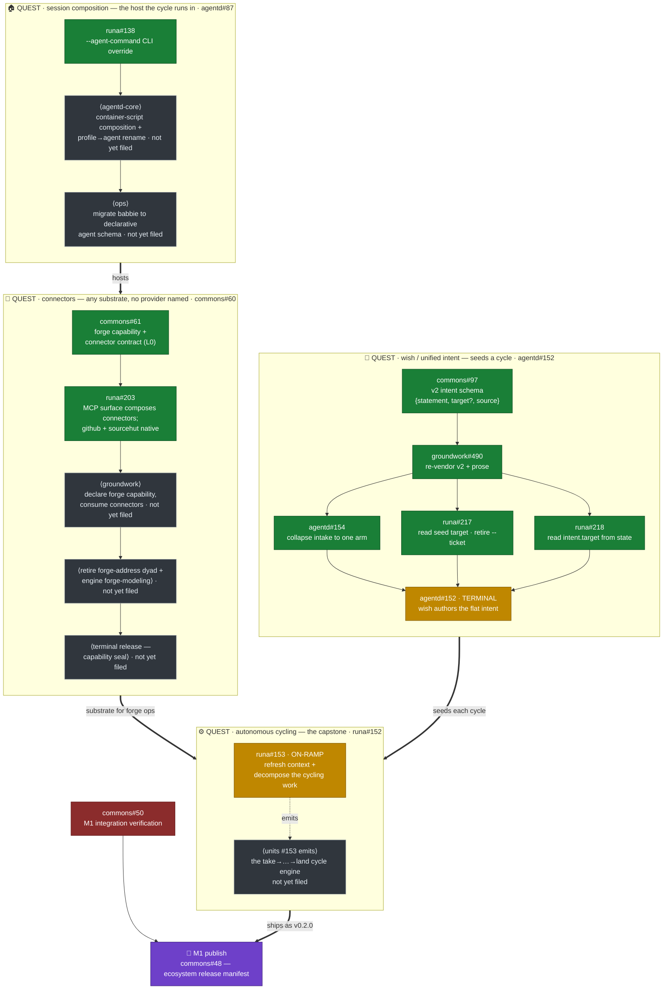

# Tesserine — Program-Line Map (the quest map)

*The navigable map of the feature lines that build the Tesserine **system**,
their work units, how they stack into one critical path, and how far each has
moved. This is the human's-eye view of the ecosystem's work graph — a single
legible document, rendered here by standard Mermaid, that you descend to reach
the live work.*

This map is the ecosystem's answer to **"where is the work going, and what's
next?"** It supersedes the nested-roadmap-in-issues realization (epic #85): the
graph does not hide inside issue bodies reachable only by descent — it lives
here, in one place, drawn.

## How to read it

A **quest** is a feature line — a clump of work units that together build one
capability of the system. A **work unit** is a single tracked issue inside a
quest. **Edges** are dependencies: what a quest (or unit) needs before it can
move. The four quests **stack into one critical path** — three substrate quests
feed the capstone, and the capstone ships the release.

**Progress reads by color:**

| State | Meaning |
|---|---|
| 🟩 **landed** | the unit is merged/closed; the work is done |
| 🟨 **ready** | unblocked and craftable now — its predecessors have landed |
| ⬛ **open** | filed and live, but gated on something upstream |
| 🟥 **blocked** | explicitly waiting on a named blocker |
| 🟪 **gate** | a convergence/release gate, not a work unit |

Every node that maps to a real issue names it (`repo#N`); descend to the tracker
for the unit's live body and comments. A node marked **⟨not yet filed⟩** is work
named in its quest's epic body but not yet a discrete issue — it points at the
epic, honestly, rather than a phantom number.

**Single Home.** This map holds the *lines, their stack, and their live
pointers* — not a copy of each issue's status text you could query. The trackers
are the live state; this is the stable graph over them. When a unit's *state*
changes, this map is refreshed against the tracker; when a quest's *shape*
changes (a line splits, a dependency reverses, a new line appears), that is an
architectural decision recorded here deliberately.

---

## The map

---

## The stack, in words

The four quests are not independent efforts. They compose:

- **wish / unified intent** (agentd#152) authors the seed — the conforming
  `intent` artifact that starts a cycle. Its entire upstream landing set
  (commons#97 → groundwork#490 → agentd#154 → runa#217/#218) has **landed**, so
  wish itself is **ready** to craft: the terminal unit that makes the seed real.
- **autonomous cycling** (runa#152) is the **capstone** — the missing runtime
  layer that consumes the seed and drives the take→specify→plan→implement→verify
  →document→submit→land cycle to completion without an operator between request
  and done. It runs its forge operations *through* connectors and executes
  *within* the composed host. Shipping it is the **v0.2.0** release intent. Its
  on-ramp, runa#153, is **ready** — it decomposes the cycling work against the
  substrate as it now exists; the units it emits become this quest's body.
- **connectors** (commons#60) is the **substrate** each cycle's forge operations
  run through: a methodology declares a capability, a connector provides it over
  one provider, the agent receives it as native MCP tools. The contract and the
  runa surface have landed; what remains is groundwork consuming the capability,
  retiring the old forge-address dyad, and the capability-seal release.
- **session composition** (agentd#87) is the **host container** the cycle runs
  in (ADR-0008: agentd composes the runtime; runa owns `.runa/`). Its first unit
  (runa#138) has landed; the container-script composition and the babbie
  migration remain. Live ecosystem testing (Phase E) is paused on this quest.

**The capstone converges with the release chain at the top.** Cycling ships as
v0.2.0, which is what the M1 publish gate (commons#48) binds — itself gated on
M1 integration verification (commons#50). So the auto-cycling quest and the M1
ecosystem-release chain meet at commons#48.

## What's ready right now

Two units are unblocked and craftable this moment:

- **agentd#152** — wish authors the flat unified intent (its whole upstream set
  has landed).
- **runa#153** — decompose the cycling capstone (its moment has arrived: the
  substrate it plans against — dual-mode, seed-target, unified intent — is now
  in place).

Everything else is either landed, gated on an upstream quest, or work named in
an epic body that has not yet been filed as a discrete unit.

---

## Keeping this current

This map is refreshed against the trackers, not transcribed from them. Two kinds
of change:

- **State refresh (routine).** A unit lands, a gate clears — the node's color
  and the "ready" list are updated to match the tracker. This happens whenever
  the map is picked up and a line is known to have moved. It is a mechanical
  re-grounding: query the named issues, correct any drift, the tracker wins.
- **Shape change (deliberate).** A quest splits or merges, a dependency
  reverses, a new quest appears, a quest completes and its capability ships, or
  a quest is promoted into the release sequence. These are architectural
  decisions — recorded here consciously, and (for release promotion) reflected
  in the release-sequence roadmap, a coarser artifact than this one.

**Altitude.** This is the *program-line* map — finer-grained and more mutable
than the ecosystem **release-sequence** roadmap (which states only what ships
next: NEXT / THEN / LATER). A quest lands units continuously here; only when a
quest is promoted to a shipping release does the release sequence change. Do not
confuse the two: this map tracks the *lines and their progress*; the release
roadmap tracks the *order releases ship*.
